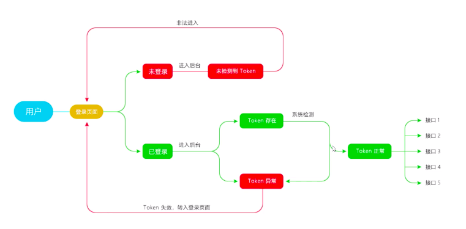

# backstage-template

## Project setup
```
npm install
```

### Compiles and hot-reloads for development
```
npm run serve
```

### Compiles and minifies for production
```
npm run build
```
# ????
## 1.1 在vue.config.js 配置全局样式  css:{}.....
## 1.2 创建login页面 和 路由设置
## 1.3 重定向到 login   re
## 1.4 将路由文件单独放在 一个文件夹中
## 1.5 删除  只剩 login组件 ，和登录路由
## 1.6 引入element
## 1.7 class 绑定的方式 （截图）
## 1.8 登录和注册按钮的切换

# 2020.8.2
## 1.1 form 布局  （邮箱，密码，获取验证码和框，登录）
## 1.2 验证（邮箱）【username, password, code】
## 1.3 新建 utils (工具文件夹)  过滤特殊字符  export 暴露出去
## 1.4 配置项目别名， 配置省略 后缀
## 1.5 验证邮箱 验证密码 提取出来（多个判断）
## 1.6 增加 重复密码   点击注册隐藏起来
## 1.7 2.0 转3.0 感觉暂时不需要学
## 1.8 安装axios  在utils中定义拦截器request.js ，创建api文件夹，api 分模块管理
## 1.9 获取验证码
## 2.0 环境变量 vue (development, production,test)
## 2.1 baseUrl timeout   http://www.web-jshtml.cn/productapi/token  options(request methods 跨域)  /devAPi/getSms

## 2.2 跨域
## 2.3 登陆和注册按钮分别显示

# 2020.8.10
## 1.1 验证码输入前 提交禁用
## 1.2 在获取验证码前，要判断邮箱是否为空，并 提示
## 1.3 拦截 resCode，进行判断, 单独引用弹出框
## 1.4  .then(res =>{})  .catch(err=>{ })
## 1.5 点击注册  和  登陆 清空表单
## 1.6 请求数据时 验证码 按钮禁用   修改按钮显示的值 获取验证码--》发送中  倒计时方法  setInterval()
## 1.7 在获取验证码等待过程中，再次点击获取验证码的bug  清除定时器
## 1.8 base64 md5 sha1  js-sha1 加密
## 1.9 请求拦截器中添加 请求头 config.headers
## 2.0 代码规整  1. 一个函数做一件事情  2.将相同代码封装到一个函数中

# 2020.9.6
## 1.1 搭建Layout首页，分三部分布局  header   Main   Nav

## 1.2 nav fixed布局  header 布局 fixed，  
## 1.3 定义总的scss

# 2020.9.
## meta 对象  （隐藏不需展示的路由）hidden  选中背景颜色#f56c6c  font-size：14px 二级目录背景  一级背景颜色
## 1. 拿到element-sub-elemt 复制， 保留两级， 拿到路由，循环一级 ，循环二级， 设置 router-index,
##   控制台-首页   项目管理（信息管理，信息分类） 用户管理（用户列表）

# 2020.9.15
## 简化公共 组件 import
## vue 重新指向
## [svgIcon组件未做](https://www.bilibili.com/video/BV1zJ411g7Fx?p=21)

# 2020.10.7

## 缩进图标 关闭图标  和用户名 用户图片

# 2020.10.8
## vueX   state,getters(computed) mutations 
## 定义class css动画 transition
## 解决vuex 刷新不保存值  1. 本地存储  2.cookies 

# 2020.10.12 
## 通过 actions 修改 isCollapse的值 dispatch   commit 
## 使用 promise  将login  迁入到  actions  .then  .catch
## modules  app分模块
##  vuex 命名空间

# 2020.10.14
## 路由守衛 路由一改變就會觸發
## 通過js_cookie  获取token  结合路由守卫
## 路由白名单  防止死循环  next()传参数 会重新 调用 路由守卫

## 接口 增加 /token
## 在登陆接口 将 token username 存到 vuex  中
## 定义常量
## username 放上去  computed

# 2020.10.17

## 路由跳转 login 时，清除token ,防止直接输入路由直接进去
## 登出
## 合并其他分支到当前分支


# 流程图
## 登陆流程图
